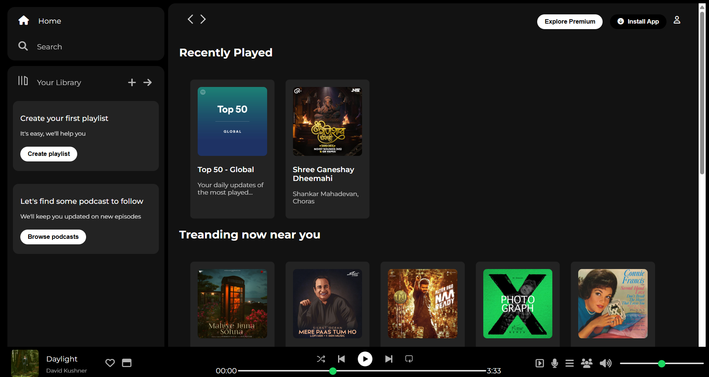
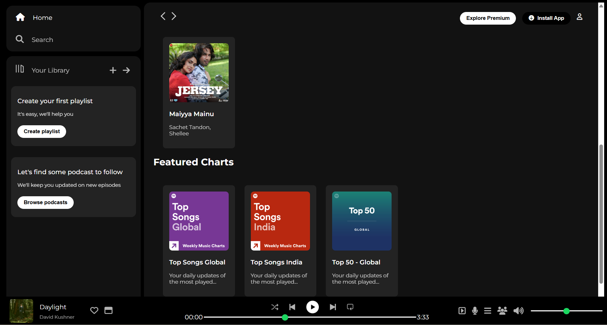

# Spotify Clone (Frontend)

A responsive Spotify UI clone built using **HTML, CSS, and JavaScript**.  
This project is a **frontend-only implementation** focusing on layout design, styling, and basic music player interactions.

---

##  Features
- Play / Pause music
- Song progress bar
- Playlist UI
- Clean and modern Spotify-like interface
- Responsive design for different screen sizes

---

## Tech Stack
- **HTML5** – Structure
- **CSS3** – Styling & layout
- **JavaScript** – Interactivity and player controls

---

## 📸 Screenshots

### Home Page

### Featured & Trending Section

---

## Note
This is a **frontend-only project** created for learning and practice purposes.  
It does not include backend functionality or the official Spotify API.

---

## Future Improvements
- Convert to **React**
- Integrate **Spotify Web API**
- Add user authentication
- Improve accessibility and animations

---

This project is for educational purposes only.
